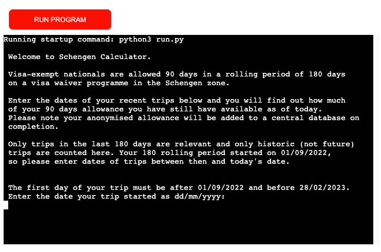

# Introduction to Schengen_Calculator 

Schengen_Calculator is a python project. The goal for the website is to allow those third country nationals who have a visa waiver access to the Schengen zone to calculate their remaining days available for the zone. Users are prompted to enter the dates of their historical trips and are given a calculation of their visa-waiver days remaining. The programme calculates the historical 180 day period from which their allowance is evaluated, checks that dates entered are valid dates, that is, that they occur after the 180 day period starts and are before the current date. Trip end dates are validated to ensure they occur after the trip start date. 

The 90 eligible days in the rolling 180 day period (the structure of the Schenge visa waiver scheme) are retrieved from a Google spreadsheet. This allows for easy update should the scheme change. A log of calculated available days is sent to the Google spreadsheet so a typical remaining allowance can be seen.

The Schengen_Calculator is designed to be provided by a company to its employees. Employees can check their remaining allowance in the programme, and Human Resources can review the typical remaining (anonymised) allowance of its employees from the Google spreadsheet. 

# Demo  

<a href="https://schengen-calculator.herokuapp.com/">Click here for a live demo</a>

Several screenshots of the website can be found below illustrating the progression of the site before and after user use.

## Page on load
This screenshot is what a user will see before they have entered any data. Instructions for use are outlined, including notification that results will be send to a central database. The user is prompted to enter the date of their first trip.

## Page on submit
This screenshot is what a user sees after they complete their trips. They receive a message with the total days of their trips, their remaining visa-waiver allowance and confirmation that their results have been added to the central database.

# Technologies Used
Python

# UX
## User Stories
As a third country national and employee, I want to know how many days left in the Schengen based on the trips I have already taken.

As a Human Resources manager, I want to know what the typical allowance remains of staff members so I can plan work accordingly.

## Strategy
The strategic aim is to create a programme that is easy to use and gives an unambiguous answer. The programme is designed to be easy to use through the automatic prevention of common errors with the use of data validation. The answer is designed to be simple by limiting it to a single, numeric response and a binary conclusion as to whether availability remains or not.  Common errors include trip start dates that are before the relevant rolling 180 day period, end dates that are before the trip start date or after the current date or invalid data entries. These errors are met with an error warning and prompt to re-enter the data. 

## Scope
This version is designed as a minimum viable product (MVP) to assess availability based on historical trips in the Schengen. Later versions could include provision to include future trips for Schengen availability on a future date. Further, employee log-in could be added so that remaining availability (saved in Google spreadsheet) could be matched to an employee. Finally, the framework could be replicated for additional visa schemes in the rest of the world.  

## Structure
The programme is deployed to a web interface, via Heroku, for user web access. It offers a single-page rolling terminal interface without navigation options. The spreadsheet that collects results is not designed to be accessible to trip users and to be read-only for HR Managers.  

## Skeleton (insert wirefames)

A flowchart was created before programming started to plan the intended
programme flow, as per the attached flowchart. The flowchart shows the progression through user input of trip start date and end date, the error handling and finally the message generated to tell the user of the result.    

   

## Features
### Features included in this current version
Users can enter their trips, by start date and end date. They are able to enter as many additional historical trips as they wish, via a prompt to select 'Add another trip? Y/N'. When they select 'N' they are given the calculation of their availability in text form. Human Resource Managers can review the Google spreadsheet to see typical availability. There are user error handling features to prevent trip dates before the relevant rolling start date or after the current date, as well as end dates before start dates. Data quality features include cleaning user input of leading/trailing whitespace. The programme can tolerate a range of likely user responses deviating from the requested Y/N input when asking about additional trips. These accommodations include: y, Yes, YES, yes, n, No, NO, no. Dates are presented in DD/MM/YYYY format in anticipation of a predominately European audience.

A screenshot illustrating the user experience when entering valid dates and being offered the opportunity to add additional trips (with a reminder of trips already entered) is attached here:

A screenshot illustrating the user experience of receiving a message calculating their trip length, their remaining availability and confirmation the data has been added to the central database is below. This screenshot also shows the programme tolerating user entry of 'no' rather than 'N' and illustrates the user experience of being reminded of multiple previous trips they have entered:

A screenshot is attached illustrating the error handling of invalid date entry ('cat' instead of a date in this instance). A user error message is generated and the user in invited to resubmit, with a prompt of valid input:

A screenshot of the error handling when a user enters an invalid response to a prompt for additional trips is below. 

A screenshot of the error handling when a user enters a trip end date that is before their trip start date is here:

A screenshot of the error handling when a user enters a trip date that is after the current date (ie a future trip not an historical one) is here:

Finally, a screenshot of the error handling when the user enters a date that is before the relevant rolling 180day start period:

### Features planned for later versions
Later versions will incorporate future trips, for a dynamic evaluation of planned trips. In addition, a user log-in feature is planned so that the availability sent to the Google spreadsheet can be matched to an employee for greater specificity. Additional data quality measures are planned, particularly a feature to prevent the user entry of overlapping trip dates. Mitigation for this potential data quality issue in the current version includes presentation to the user of trip dates they have already entered at the time of asking whether they want to add another trip. Future user experience improvements, such as programmatic handling of user created leading/trailing whitespace on trip dates (rather than the current approach of producing an error message in these instances) will be introduced to match this feature already available for user responses to additional trip prompts. 

# Deployment
Google API was set up via: 
https://console.cloud.google.com/ A new project ('schengencalculator') was created. From here, navigate to 'API and Services' and then 'Library' from teh memu. Using the search bar to find the Google API, it was enabled and then credentials created. The following options were selected:
Which API are you using: Google Drive API
What data will you be accessing: Application Data
Are you planning to use this API with Compute Engine, Kubernetes Engine, App Engine, or Cloud Functions?: 'No, I'm not using them'

From within Credentials on the menu, the service account was selected and then Keys was selected from the available menu. From here 'Add Key' -> 'Create New Key' with 'JSON' selected as key type. The file that was created and downloaded was saved into the directory as 'creds.json'. The client email account from wtihin this file was shared with the Google sheet that is linked to this programme.

Finally, from within the Library tab on the menu, Google Sheets API was searched for and enabled. 

Sensitive data in the cred.json file was withheld from being pushed to GitHub by listing in .gitignore

Two dependencies, Google-auth (needed to authenticate access to the Google cloud account for the spreadsheet) and gspread (a library), were installed using 'pip3 install gspread google-auth' in the command line and then imported into directory file: 'run.py'

Development was within a Github repository, based on the Code Institute template: https://github.com/Code-Institute-Org/python-essentials-template . Repository is: https://github.com/BlueBindy/schengen_calculator and was built using the Gitpod button on the template repository menu. The deployed site is deployed from the master branch and will update automatically upon new commits to the master branch.

To run locally, you can clone this repository directly into the editor of your choice by pasting `git clone https://github.com/BlueBindy/schengen_calculator.git` into your terminal. To cut ties with this GitHub repository, type `git remote rm origin` into the terminal.

Deployment to Heroku
Dependencies necessary for deployment to Heroku were adding by using 'pip3 freeze > requirements.txt' to terminal 

From Heroku dashboard, 'Create New App' was selected from the menu. App is called 'schengen-calculator'. In the Settings tab, a config var was set up for creds.json (which is not pushed to GitHub but is required by Heroku for deployment.) In Config Vars, for Key, 'CREDS' was entered. In Value, the contents of creds.json file was copied and pasted. An additional Key, PORT, with value 8000, was also added. 

Python and node.js were added as Buildpacks (in that order).

In the Deploy tab, GitHub was chosen and connected. Automatic deployment was selected. Then Deploy using branch: main. 

The live app, hosted by Heroku, is available at: https://schengen-calculator.herokuapp.com/

# Testing
All tests peformed on 'https://schengen-calculator.herokuapp.com/' on Chrome, Opera and Firefox browsers on a 13-inch early 2015 Macbook Air using MacOS Monterey v12.6.2. 
## 1. Functionality Testing
### Test label: Connectivity to Google spreadsheet
| Test step | Outcome |
| --- | --- |
| Test action | Confirm data is flowing from sheet to programme and back |
| Expected outcome | Data contained in 'restricted-period' and 'visa_allowance' sheets is available to variables in programe (via Googleauth credentials and gspread import), and appear in print statements when programme is run. User results of remaining visa-waiver allowance populate 'days_available' sheet after programme is run. |
| Notes | ...  |
| Test outcome | PASS |  

### Test label: Deployment to Heroku
| Test step | Outcome |
| --- | --- |
| Test action | Manually confirm programme is accessible to users in a Chrome, FireFox and Opera web tab at `https://schengen-calculator.herokuapp.com/` |
| Expected outcome | Programme is accessible, and perform as expected, in a web interface hosted by Heroku |
| Notes | Programme accessible in Chrome, FireFox, Opera. Additional testing also confirmed programme worked in browsers Edge and DuckDuckGo. However, Safari does not allow user entries at programme prompt. StackOverflow (user Omar Hussein) suggests it is caused by Safari disallowing the structure of a domain pointing to a CNAME record that points to the app, and the fix is a A-RECORD rather than a cloaked CNAME. No changes have been made to the CNAME record as this is part of the template implementation used in this programme.  |
| Test outcome | PASS with Safari exception noted | 

### Test label: Calculation of days used, days available, current date, visa-waiver rolling period start
| Test step | Outcome |
| --- | --- |
| Test action | Manually confirm programme accurately calculates and presents to the user: days used, days available, current date, visa-waiver rolling period start based on their input or programme run. |
| Expected outcome | Current date and visa-waiver rolling period starts should be accurately presented to the user via message and text content. Days used and days available should be accurately presented to the user after they have submitted their trips. |
| Notes | This version does not prevent a user entering overlapping trip dates. Current mitigation is a user warning and the presentation of user entered dates to the user when prompting for additional trips, but user errors can still occur. If overlapping trips are entered, the calculation of days used will be over-stated and days available understated. Subseqent versions will address this.|
| Test outcome | PASS |  

### Test label: Error messages for invalid dates
| Test step | Outcome |
| --- | --- |
| Test action | Enter user data responses that inavlid, namely: a) precede the rolling waiver period b) are in the future and c) trip end date preceded trip start date |
| Expected outcome | All invalid date responses should produce a message letting user know they have entered invalid data and prompt another attempt. |
| Notes | None to add |
| Test outcome | PASS |  

### Test label: Error messages for invalid entries for trip dates
| Test step | Outcome |
| --- | --- |
| Test action | Enter user data responses to trip prompts that a) are blank b) are not in dd/mm/yyyy format |
| Expected outcome | Blank or invalid date format (including invalid dates such as 35/01/2022 and leading/trailing whitespace) should produce a message letting user know they have entered invalid data and prompt another attempt. |
| Notes | None to add |
| Test outcome | PASS |  

### Test label: Error messages for invalid response to additional trip prompt
| Test step | Outcome |
| --- | --- |
| Test action | Enter user data responses to additional trip prompts that a) are blank b) are not Y/N format |
| Expected outcome | Blank or invalid entries should produce an error message and a prompt for another attempt. Expected similar responses to requested format (including y, YES, Yes, yes, n, NO, No, no) are programmatically handled without user error message. Leading and trailing whitespace is also accommodated programmatically. |
| Notes | None to add |
| Test outcome | PASS | 

### Test label: File organisation
| Test step | Outcome |
| --- | --- |
| Test action | Manually review all files and directories |
| Expected outcome | Files deploy as expected, all images render. |
| Notes | |
| Test outcome | PASS |  

## 4. Validator Testing
### Code Institute Python Linter
| Test step | Outcome |
| --- | --- |
| Test action | Perform a Linter validation test |
| Expected outcome | Validation passed with zero flagged results (with discretion applied to code line length as appropriate.) |
| Notes | XXXXXXX |
| Test outcome | PASS (screenshot attached)|  

# Acknowledgements and Copyright
SCOPE code and code to link the programme to the Google Sheet was taken from Code Institute Python Essentials Project Walthrough module

README structure derived from the Code Institute's example. The structure and The testing approach and structure is based on advice from Brian Macharia.  

Mentoring from Brian Macharia. All errors and ommissions the responsibility of Fiona Thompson.

Content is drafted by Fiona Thompson.

ENDS

-------------------------
